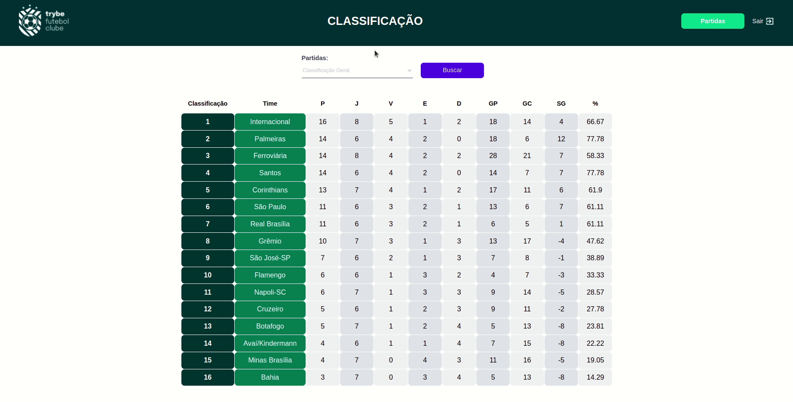

<h1>⚽ TFC - Trybe Futebol Clube! ⚽</h1>

<h2>Índice</h2>
<h4>- <a href="#context">Contexto</a></h4>
<h4>- <a href="#tecnologies">Técnologias utilizadas</a></h4>
<h4>- <a href="#development">Desenvolvimento</a></h4>
<h4>- <a href="#howtouse">Como executar o projeto</a></h4>

<h2 id="context">Contexto</h2>

O TFC foi desenvolvido para ser um site informativo sobre partidas e classificações de futebol!

Esse projeto foi desenvolvido durante o curso da Trybe com o objetivo de treinar e consolidar os estudos de Docker, MySQL, Sequelize, Typescript, NodeJS, Express, MSC, POO e testes de integração em back-end, foi realizado em Junho de 2022, durante o módulo de Back-end.

Neste projeto sou o autor de todo Back-end da aplicação, sendo o Front-end desenvolvido pela escola Trybe.

<h2 id="tecnologies">Técnologias utilizadas</h2>

<ul>
  <li>Docker</li>
  <li>MySQL e Sequelize</li>
  <li>Typescript</li>
  <li>NodeJS</li>
  <li>Express</li>
  <li>API Rest - CRUD</li>
  <li>Modelo de camadas MSC e POO</li>
  <li>Testes de integração - Mocha, chai e sinon</li>
</ul>

<h2 id="development">Desenvolvimento</h2>

Neste projeto pude implementar todo o <b>back-end</b> <i>(./app/backend)</i> da aplicação TFC, de modo que o usuário possa ver a tabela atualizada e também o resultado de cada jogo.

Para o usuário do administrador é possível adicionar mais partidas, atualizando automaticamente a tabela.

Foi utilizado o docker-compose com o papel de unir todas as partes e subir um projeto completo.

Banco de dados criado em MySQL, utilizando a ferramenta Sequelize. Foram adicionados dados por via de Seeders para popular a tabela e mostrar o funcionamento.

O Back-end foi desenvolvido utilizando NodeJS, Typescript e Express. Implementando regras de negócio para popular adequadamente a tabela disponível no front-end que será exibida para a pessoa usuária do sistema.

<h2 id="howtouse">Como executar o projeto</h2>

  1. Clone o repositório
    * `git clone https://github.com/gustavo-pd/project-trybe-futebol-clube.git`.
    * Entre na pasta do repositório que você acabou de clonar:
      * `cd project-trybe-futebol-clube`
 

  2. Instale as dependências:
    * `npm install`
 

  3. Rode o Docker para unir e subir todas as partes:
    * `npm run compose:up` para upar ou `npm run compose:down` para derrubar
 

  4. O front-end irá rodar na porta 3000, e o back-end na porta 3001, para acessar o front-end, acesse no seu navegador:
  * `http://localhost:3000`
 

  5. Para fazer login com o admin e poder gerenciar partidas:
  * Login: `admin@admin.com` Password: `secret_admin`
 

  Para fazer login como usuário:
  * Login: `user@user.com` Password: `secret_user`
 
 
 
  

Na sua máquina você deve ter:
 
 - Sistema Operacional Distribuição Unix
 - Node versão 16  
 - Docker
 - Docker-compose versão 1.29.2
 	

➡️ O `node` deve ter versão igual ou superior à `16.15.0 LTS`. 
	* Para instalar o nvm, [acesse esse link](https://github.com/nvm-sh/nvm#installing-and-updating);
	*Rode os comandos abaixo para instalar a versão correta de `node` e usá-la:
		* `nvm install 16 --lts`
		* `nvm use 16`
		* `nvm alias default 16` 
 

➡️ O`docker-compose` deve ter versão igual ou superior à`ˆ1.29.2`:
	* Use esse [link de referência para realizar a instalação corretamente no ubuntu](https://app.betrybe.com/course/back-end/docker/orquestrando-containers-com-docker-compose/6e8afaef-566a-47f2-9246-d3700db7a56a/conteudo/0006a231-1a10-48a2-ac82-9e03e205a231/instalacao/abe40727-6310-4ad8-bde6-fd1e919dadc0?use_case=side_bar);
	* Acesse o [link da documentação oficial com passos para desinstalar] (https://docs.docker.com/compose/install/#uninstallation) caso necessário.
