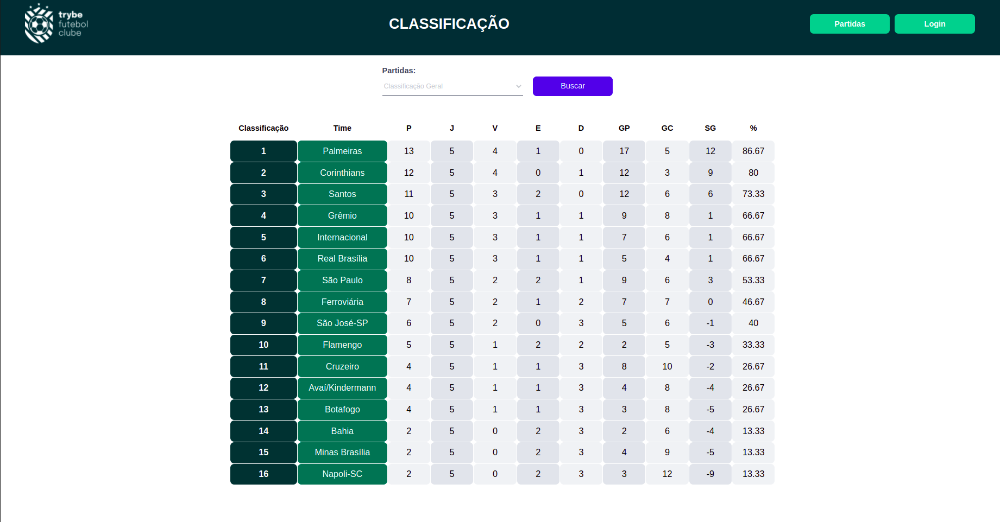

<h1>⚽ TFC - Trybe Futebol Clube! ⚽</h1>

<h2>Contexto</h2>

O TFC foi desenvolvido para ser um site informativo sobre partidas e classificações de futebol!

Neste projeto sou o autor de toda parte de back-end, sendo o front-end desenvolvido pela escola Trybe.

<h2>Técnologias usadas</h2>

<ul>
  <li>Docker</li>
  <li>MySQL e Sequelize</li>
  <li>Typescript</li>
  <li>NodeJS</li>
  <li>Express</li>
  <li>API Rest - CRUD</li>
  <li>Modelo de camadas MSC e POO</li>
  <li>Testes de integração - Mocha, chai e sinon</li>
</ul>

<h2>Desenvolvimento</h2>

Neste projeto pude implementar todo o <b>back-end</b> <i>(./app/backend)</i> da aplicação TFC, de modo que o usuário possa ver a tabela atualizada e também o resultado de cada jogo.

Para o usuário do administrador é possível adicionar mais partidas, atualizando automaticamente a tabela.

Foi utilizado o docker-compose com o papel de unir todas as partes e subir um projeto completo.

Banco de dados criado em MySQL, utilizando a ferramenta Sequelize. Foram adicionados dados por via de Seeders para popular a tabela e mostrar o funcionamento.

O Back-end foi desenvolvido utilizando NodeJS, Typescript e Express. Implementando regras de negócio para popular adequadamente a tabela disponível no front-end que será exibida para a pessoa usuária do sistema.

<!-- Olá, Tryber!

Esse é apenas um arquivo inicial para o README do seu projeto.

É essencial que você preencha esse documento por conta própria, ok?

Não deixe de usar nossas dicas de escrita de README de projetos, e deixe sua criatividade brilhar!

⚠️ IMPORTANTE: você precisa deixar nítido:
- quais arquivos/pastas foram desenvolvidos por você; 
- quais arquivos/pastas foram desenvolvidos por outra pessoa estudante;
- quais arquivos/pastas foram desenvolvidos pela Trybe.

-->
